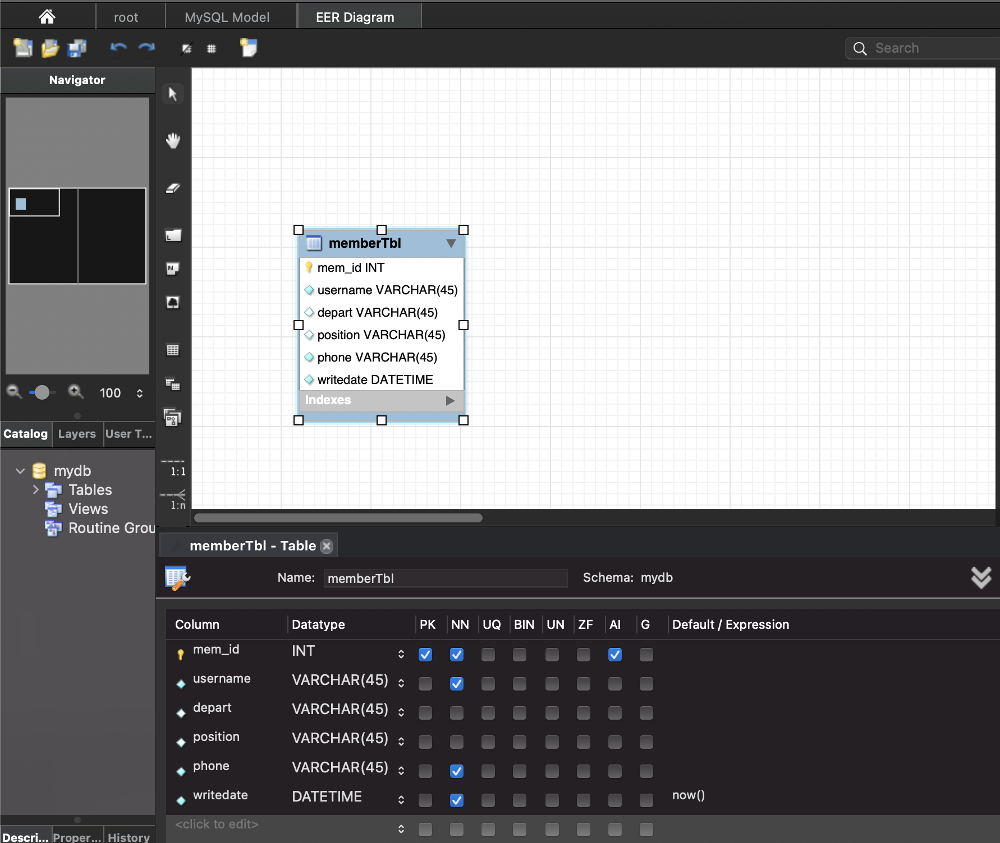

# Database: MySQL Tables

> Tue Jun 28, 2022

---

[toc]

## 테이블 생성

### 데이터베이스 생성 / 선택

데이터를 저장할 테이블을 생성하려면 어느 데이터베이스에서 테이블을 생성할지 정해줘야 합니다.

`CREATE DATABASE test_db`

`USE test_db`


 ### 테이블 설계

| 테이블명: member |
| ---------------- |

| 사원번호    | 사원명   | 부서명  | 직급     | 전화번호 | 등록일    |
| ----------- | -------- | ------- | -------- | -------- | --------- |
| mem_id      | Username | Depart  | position | tel      | Writedate |
| 숫자        | 문자 30  | 문자 30 | 문자 20  | 문자 15  | 날짜      |
| integer     | varchar  | Archer  | varchar  | varchar  | Datetime  |
| Primary Key |          |         |          |          |           |
| Not null    | Not null | Null    | Null     | Not null | Not null  |

* Primary Key : 중복될 수 없는 고유번호


### 테이블 생성

```mysql
CREATE TABLE member (
    mem_id INT PRIMARY KEY,
    username VARCHAR(30) NOT NULL,
    depart VARCHAR(30),
    position VARCHAR(20),
    tel VARCHAR(15) NOT NULL,
    writedate DATETIME DEFAULT NOW()
)
```

`writedate DATETIME DEFAULT NOW()` 

- 사용자가 직접 입력을 하지 않아도 될때 `default` 를 입력합니다.


### 같은 테이블 만들기

```mysql
-- emp 테이블과 같은 테이블 만들기
create table emp2
as
select * from emp;
```


### 테이블 삭제

```mysql
show tables;
drop table emp2;
```


## 데이터 조작어 (DML)

> 데이터의 삽입, 수정, 삭제
>
> CRUD: C:insert, R:select, U:update, D:delete


### Insert

```mysql
-- Syntax
insert into 테이블명(column1, column2...)
values(value1, value2...)
```

```mysql
insert into emp2(empno, ename, deptno, job, sal, comm, mgr, hiredate)
values(7777, 'John', 40, 'CEO', 55000, 1000, 7788, now());

select * from emp2;
```


### Update

```mysql
-- Syntax
UPDATE table_name
SET column1 = 값(고칠내용), column2 = 값
WHERE 조건
```

```mysql
set SQL_SAFE_UPDATES = 0;  # disable safe mode

update emp2 set sal=60000 where empno=7777;
update emp2 set sal=sal*1.1;

set SQL_SAFE_UPDATES = 1;  # enable safe mode
```


### Delete

```mysql
-- Syntax
DELETE FROM table_name 
WHERE column1=값(지울값)
```

```mysql
delete from emp2 where ename='Kaycee';
delete from emp2 where deptno=10;
```


## 테이블의 관리 (DDL)

>  테이블의 컬럼의 관리는 ADD, MODIFY, DROP 연산자를 통해서 할 수 있습니다.


### Add

테이블의 새로운 컬럼을 추가할때 사용합니다.

```mysql
-- Syntax
ALTER TABLE 테이블명 ADD 컬럼명 데이터타입;
```

```mysql
-- 이메일 필드 추가
ALTER TABLE member ADD email varchar(50);
```


### Modify

테이블의 컬럼의 크기를 수정할때 사용합니다.

```mysql
-- Syntax
ALTER TABLE 테이블명 MODIFY 컬럼명 데이터타입;
-- 필드명 수정
alter table member change tel phone varchar(20);
```


### Change

테이블 컬럼명을 수정할때 사용합니다.

```mysql
-- 필드명 수정
alter table member change tel phone varchar(20);
```


### Delete

테이블 컬럼을 삭제할때 사용합니다.

```mysql
-- 필드삭제
alter table member drop column position;
```


## 데이터베이스 모델링 EER Diagram

> Menu: Database > Model > Add a diagram > Place a new table
>
> Menu: Database > Forward Engineering > ** schema = multi or other than mydb 




참조되는 테이블 (author_tbl, pub_tbl) 을 먼저 만들고 참조하는 테이블 (book_tbl) 을 만듭니다.

다른 테이블의 정보를 참조하는 것을 외래키 (Foreign Key) 설정이라고 합니다.

Book_tbl 의 FK -> author_tbl, pub_tbl 의 PK 로 1 to many 관계를 설정해줍니다.

* CASCADE : 참조되는 테이블에서 record 가 지워지면 참조하는 테이블에서 record 를 지울것인지를 설정합니다.